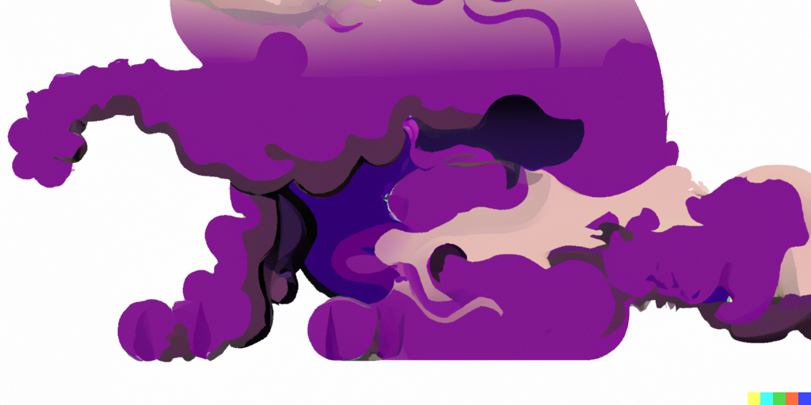

    <picture>
        <source media="(prefers-color-scheme: dark)" srcset="doc/cat1_dark.png">
        <source media="(prefers-color-scheme: light)" srcset="doc/cat1.png">
        
    </picture>
    

        

            <h2>Open profile</h2>
        

        

            
        

        

            
<h3>About me</h3>

            

                💡 &nbsp;I like to solve problems, learn new technologies and enjoy life outside.  
                🎓 &nbsp;I'm currently studying Computer Engineering at the Budapest University of Technology and Economics.  
                🌱 &nbsp;I'm on track for learning more about Artificial Intelligence, Systems Design and WEB development.  
                🏈 &nbsp;In my free time, I like doing outdoor sports of all kind and  
                🖌️ &nbsp;I also like painting, drawing and glass engraving.  
                ✉️ &nbsp;You can shoot me an email at <a href="mailto:bajnokvencel@edu.bme.hu">bajnokvencel@edu.bme.hu</a>! I'll try to respond as soon as I can.      
            

        

        

            
<h3>Technology stuff</h3>

            

                <ul>
                    <li>
                        <strong>Currently working with:</strong>
                        

                            
                            
                            
                            
                            
                            
                            
                            
                            
                            
                        

                    </li>
                    <li><strong>Other languages:</strong>
                        

                            
                            
                            
                            
                            
                            
                            
                            
                            
                        

                    </li>
                    <li><strong>Other environments:</strong>
                        

                            
                            
                            
                            
                            
                            
                            
                            
                            
                            
                        

                    </li>
                </ul>
            

        

        

            
<h3>Stats</h3>

            

                <picture>
                    <source media="(prefers-color-scheme: dark)" srcset="https://github-readme-stats.vercel.app/api?username=Breinich&show_icons=true&hide_border=true&&count_private=true&include_all_commits=true&theme=dark">
                    <source media="(prefers-color-scheme: light)" srcset="https://github-readme-stats.vercel.app/api?username=Breinich&show_icons=true&hide_border=true&&count_private=true&include_all_commits=true">
                    
                </picture>
                <picture>
                    <source media="(prefers-color-scheme: dark)" srcset="https://github-readme-stats.vercel.app/api/top-langs/?username=Breinich&show_icons=true&hide_border=true&layout=compact&langs_count=8&theme=dark">
                    <source media="(prefers-color-scheme: light)" srcset="https://github-readme-stats.vercel.app/api/top-langs/?username=Breinich&show_icons=true&hide_border=true&layout=compact&langs_count=8">
                    
                </picture>
                 
                <picture>
                    <source media="(prefers-color-scheme: dark)" srcset="https://github-readme-streak-stats.herokuapp.com/?user=Breinich&hide_border=true&theme=dark">
                    <source media="(prefers-color-scheme: light)" srcset="https://github-readme-streak-stats.herokuapp.com/?user=Breinich&hide_border=true">
                    
                </picture>
                 
                NOTE: Top Languages does not indicate my skill level, it's a GitHub metric of which languages have the most code on my public GitHub account.
                <a href="https://Breinich.github.io/Breinich/">
                <picture>
                  <source media="(prefers-color-scheme: dark)" srcset="https://raw.githubusercontent.com/Breinich/Breinich/output/github-contribution-grid-snake-dark.svg" />
                  <source media="(prefers-color-scheme: light)" srcset="https://raw.githubusercontent.com/Breinich/Breinich/output/github-contribution-grid-snake.svg" />
                  
                </picture>
            

        

    

    <picture>
        <source media="(prefers-color-scheme: dark)" srcset="doc/cat2_dark.png">
        <source media="(prefers-color-scheme: light)" srcset="doc/cat2.png">
        
    </picture>

<a href="https://openai.com/product/dall-e-2">credit</a>

    <h2>Bonus for you</h2>
    <picture>
        <source media="(prefers-color-scheme: dark)" srcset="https://readme-jokes.vercel.app/api?hideBorder&aColor=%23FFFFFF">
        <source media="(prefers-color-scheme: light)" srcset="https://readme-jokes.vercel.app/api?borderColor=%23000000&&bgColor=%23FFFFFF&aColor=%23000000">
        
    </picture>

